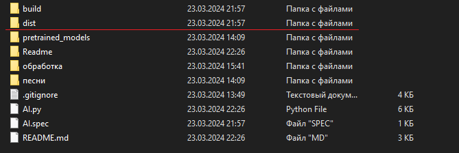
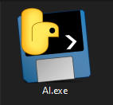
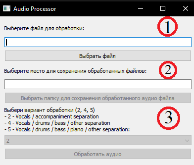
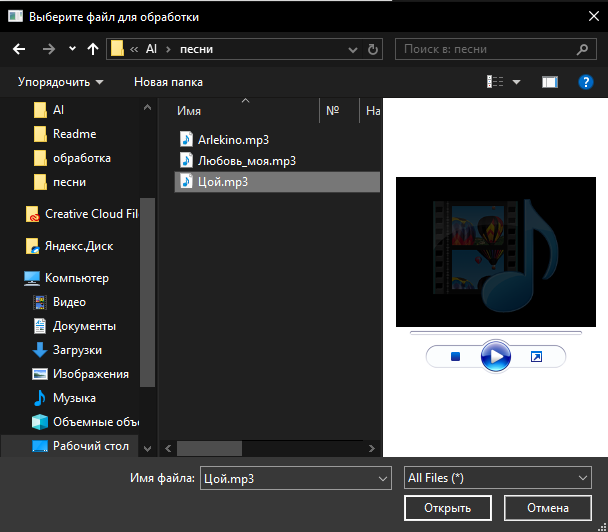

# AI Cover 

Сервис для создания нейро-каверов на песни, объединяющий и упрощающий использование нескольких инструментов.
## Оглавление
[Требования](#Требование)  
[Использование](#Использование)  
[В планах](#В_планах)  
[Требование](#Требования)  
## Инструменты
- python 3.8
- ffmpeg
- spleeter - библиотека для разделения аудиофайла на вокал и минус
- SoftVC VITS Singing Voice Conversion - нейросеть для изменения вокала
- pydub - соединение изменённого вокала и минуса
- PyQt - создание полноценного GUI 
## Использование
- Для того, чтобы использовать альфа-версию продукта перейдите в папку dist в котором находится AI.exe.

- Если этой папки нет, то соберите её сами:
- Установите pyinstaller, если у вас его еще нет, с помощью pip: pip install pyinstaller
- Перейдите в каталог, содержащий ваш Python-скрипт, используя командную строку.
- Затем запустите pyinstaller, указав путь к скрипту: pyinstaller AI.py  

- После запуска вы увидите маленькое окно в котором на данный момент есть "Выбор файла" (1) который будет обрабатываться, "Выбор папки" (2) куда будет сохранятся обработка, так же есть варианты обработки (3), которые можно менять (2, 4 и 5), где 
- 2 - Vocals / accompaniment separation
- 4 - Vocals / drums / bass / other separation
- 5 - Vocals / drums / bass / piano / other separation  

- После нажатия на кнопку "Выбрать файл" (1) появится проводник в котором нужно выбрать желаемый файл для обработки (Для примера был выбран файл - Цой.mp3).

- После выбора вы сумеете указать папку, где будет создана папка с обработанной музыкой (По умолчанию это "Рабочий стол").
- Следующий шаг - выбрать вариант обработки (По умолчанию стоит 2-о1 вариант).
- При нажатии на кнопку "Обработать аудио", программа начнёт разделять аудиофайл на компоненты, которые вы выбрали в прошлом пункте. 
## !Если программа зависла, ничего не трогайте, идёт обработка, которая займёт от 1 до 4 минут!
- В конце работы вы получите папку, в которой будет разделённый аудиофайл.

## В планах
- [ ] Установка всех зависимостей
    - [x] spleeter
    - [ ] SoftVC VITS Singing Voice Conversion
    - [ ] pydub
- [x] Минимальный консольный UI  
- [ ] Реализация изменения голоса 
- [ ] Слияние звуковых дорожек
- [ ] полноценный GUI
## ЧаВо
## Источники

[Оглавление](#Оглавление)
